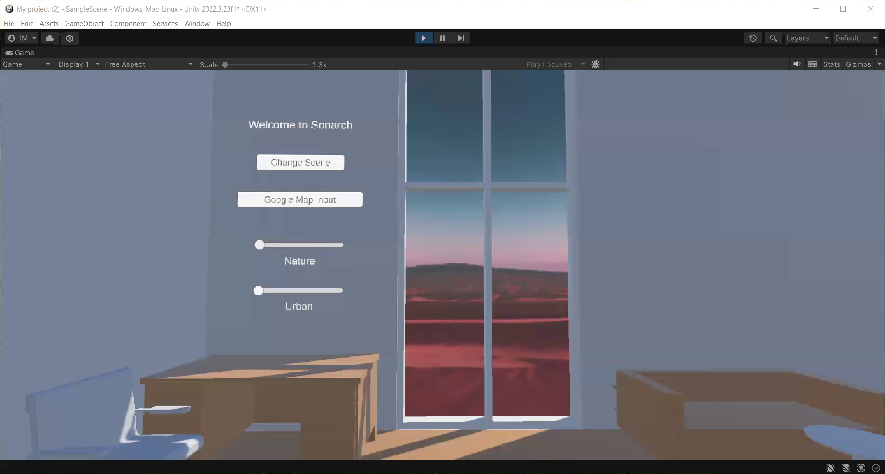

<h2 align="center">  Sonarch: Integrating Wellness Design and Mixed Reality Technology in
Gradient Reality Therapy Rooms </h2>

    Isandro Gutierrez Malik， Tai Anthony McMillan

## Usage
You can find the Unity project files in the <a href="https://drive.google.com/file/d/1RrZf6_ZXoxqH4CripT7SHGHny30A7yGT/view?usp=sharing">google link</a>. To use it, download the zip file and extract it. Use your unity hub to open this project.

## Demo

